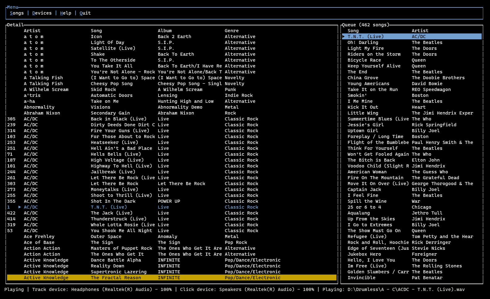

# Drum Weaver.
> A simple windows console application that plays drumless audio with a click track on separate channels.
> Useful for practicing with the click in your ear and audio on speakers/PA systems.

# Getting started
1. For background on why this was created, check out this [original reddit thread.](https://www.reddit.com/r/edrums/comments/1162lyh/sharing_my_library_of_5000_drumless_songs_with/)
2. Decode this for the download link: ```aHR0cHM6Ly9tZWdhLm56L2ZvbGRlci9mVjEzbFR6SyNwWndtTV82YzI2U3hWMjdIa3VVRjZB```
3. Download all the files
4. Download and execute ```drum_weaver```


# Notes
1. There are many shortcuts to help set things up. There's a help page with details.
2. Sometimes the click track will fall out of sync. This is typically due to the original translation and not CPU usage.
3. The list of songs is embedded in the application directly. At some point, I will add some management capabilities on the master list.
4. Playlists are stored and loaded automatically.
5. You can search by artist, album, or genre.

# Improvements
1. Master playlist management (Adding songs to an ignore list, etc)
2. Playing main track at lower volume on click device. (Useful if using pro headsets that have sound cancellation)
3. Consider egui for the frontend. (I tried and failed a couple of times. #rookie)
